# FlightScnr Pi

A [round **4″ touch display**](https://www.waveshare.com/4inch-dsi-lcd-c.htm?&aff_id=108718) flight and marine tracker for Raspberry Pi. Dark radar UI, animated sweep, map tiles, gesture navigation, LiveATC audio, and a local **web portal** for setup — no SSH required for day-to-day use. Modeled after [FlightScnr](https://github.com/yashmulgaonkar/FlightScnr).

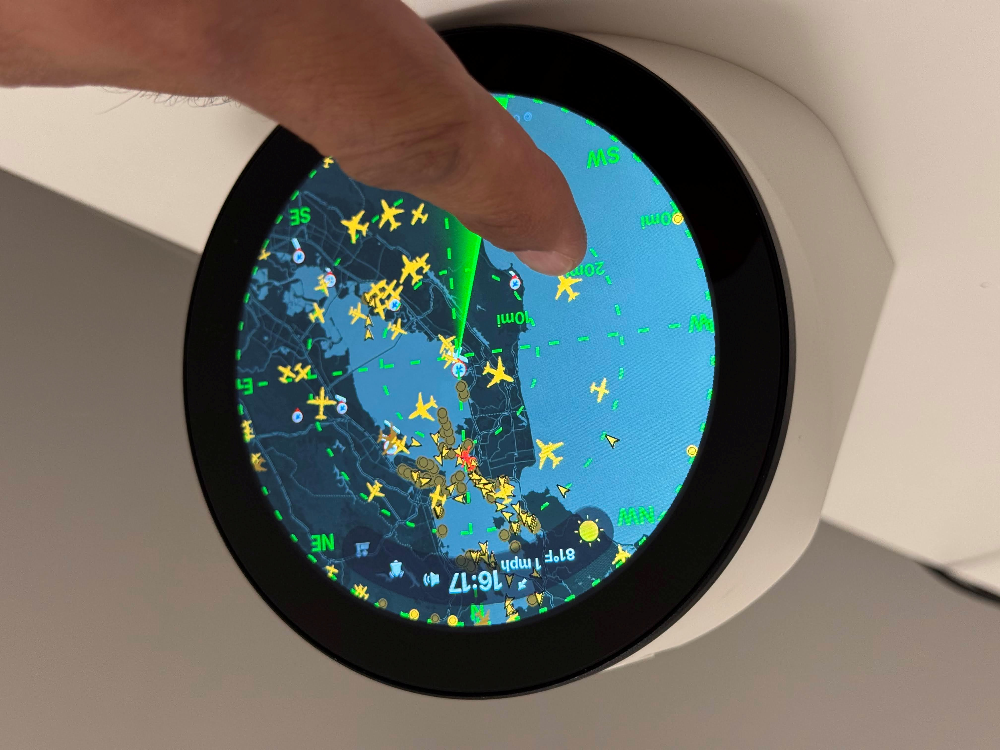

<div align="center">
<a href="https://buymeacoffee.com/yashmulgaonkar"></a>
<br>
<a href="https://discord.gg/wjqgUjv8Re"></a>
<br><br>
<strong><a href="https://discord.gg/wjqgUjv8Re">FlightScnrPi Discord</a></strong> — community help, builds, and troubleshooting
</div>
---

## Features

Live aircraft (and optional marine traffic) on a circular radar, with rich detail screens when you tap. Powered by **FR24**, **[adsb.fi](https://adsb.fi)**, optional local dump1090/readsb, **Tomorrow.io** weather, optional precipitation from **[LibreWXR](https://librewxr.net/)** (RainViewer fallback), optional route enrichment, **USGS earthquakes**, and wildfire layers (CAL FIRE / NIFC / NASA FIRMS). Configure everything from the web portal. Full detail: [Features wiki](https://github.com/yashmulgaonkar/FlightScnr_Pi/wiki/Features).

Current release: **2026.8.21.2** on `main`.

### Screens

Radar home, flight detail, **tracked flight** with route map, **Follow / Live** map, and clock / weather — swipe between them on the 720×720 round touch display. **Swipe right** on radar opens Tracked (when a track is active), then again for Follow / Live. **Swipe left** cycles Home and saved favorite locations.

<table>
<tr>
<td align="center" width="50%">


**Radar**

</td>
<td align="center" width="50%">

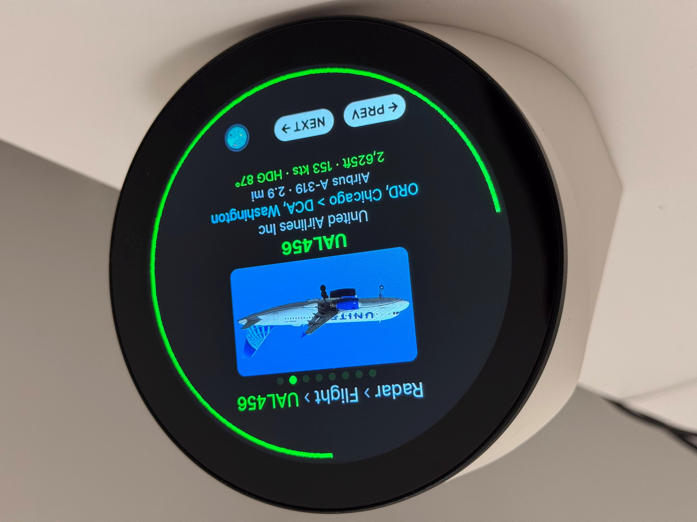

**Flight detail**

</td>
</tr>
<tr>
<td align="center" width="50%">

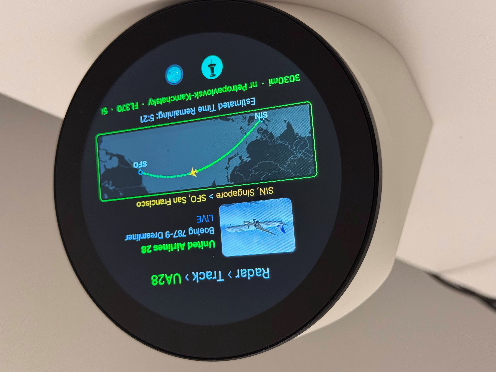

**Tracked flight**

</td>
<td align="center" width="50%">

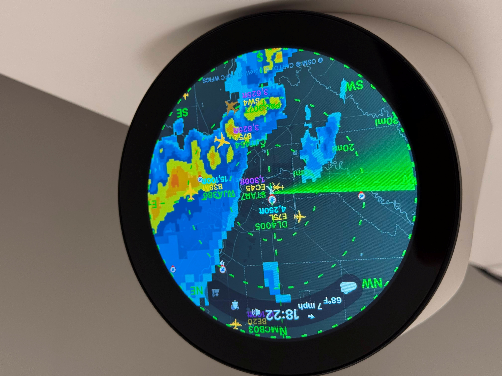

**Clock & weather**

</td>
</tr>
</table>

### Map layers

Ten basemap styles: CARTO dark/light/Voyager (free `CARTO_BASEMAPS_API_KEY`), OSM dark, **Dark Flat** (solid black), Stadia dark + Toner (free `STADIA_MAPS_API_KEY`), Esri streets/satellite, and free FAA VFR sectionals (US). Optional **tag leaders**, **color by altitude**, precipitation, airport overlays, wildfires, and earthquakes.

<table>
<tr>
<td align="center" width="50%">

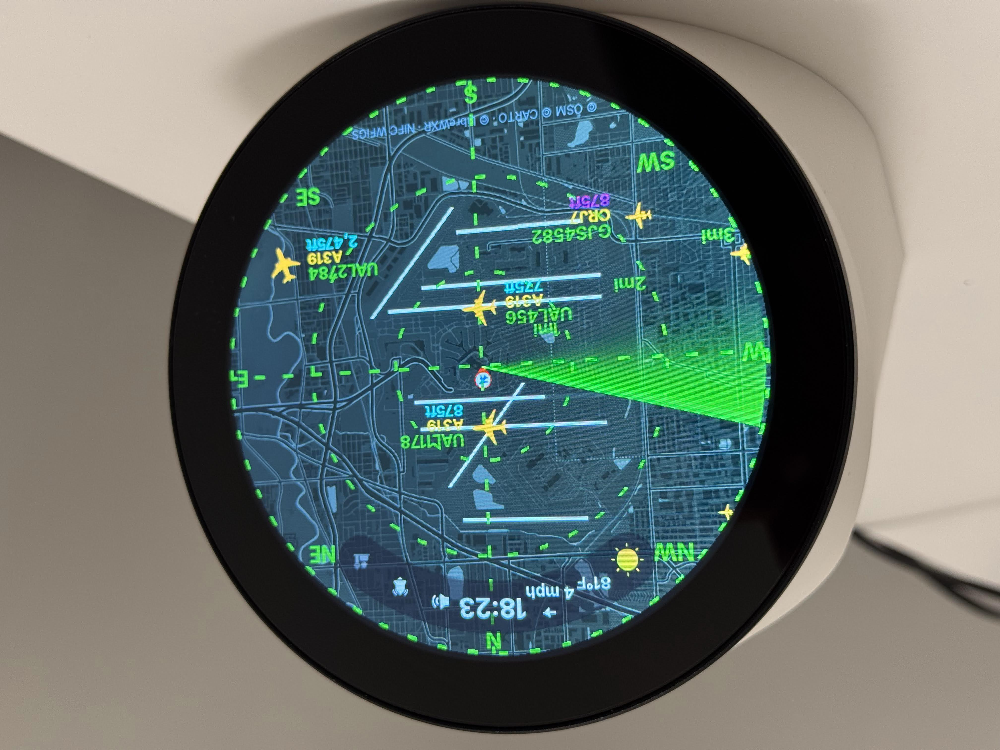

**Dark**

</td>
<td align="center" width="50%">

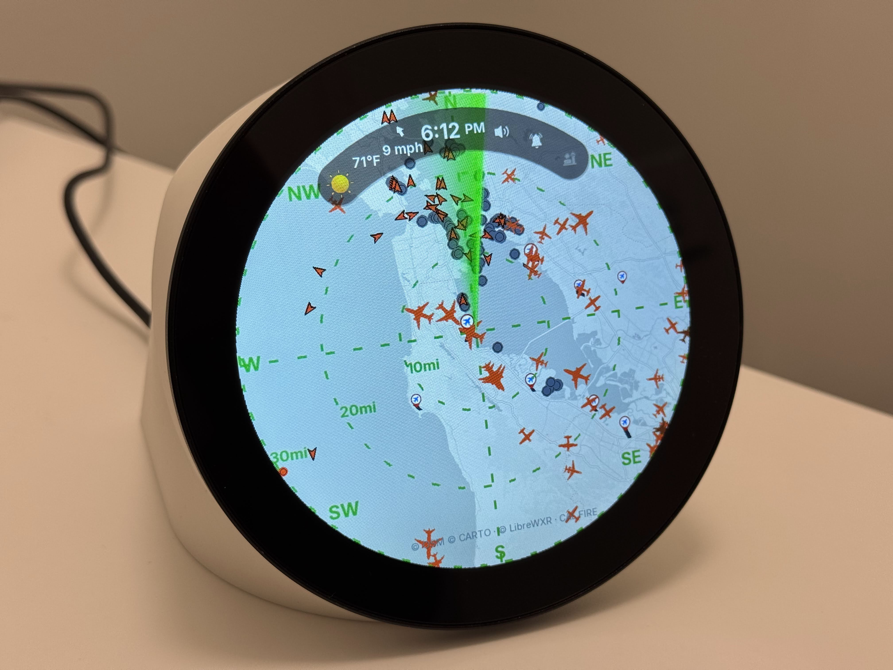

**Voyager**

</td>
</tr>
<tr>
<td align="center" width="50%">

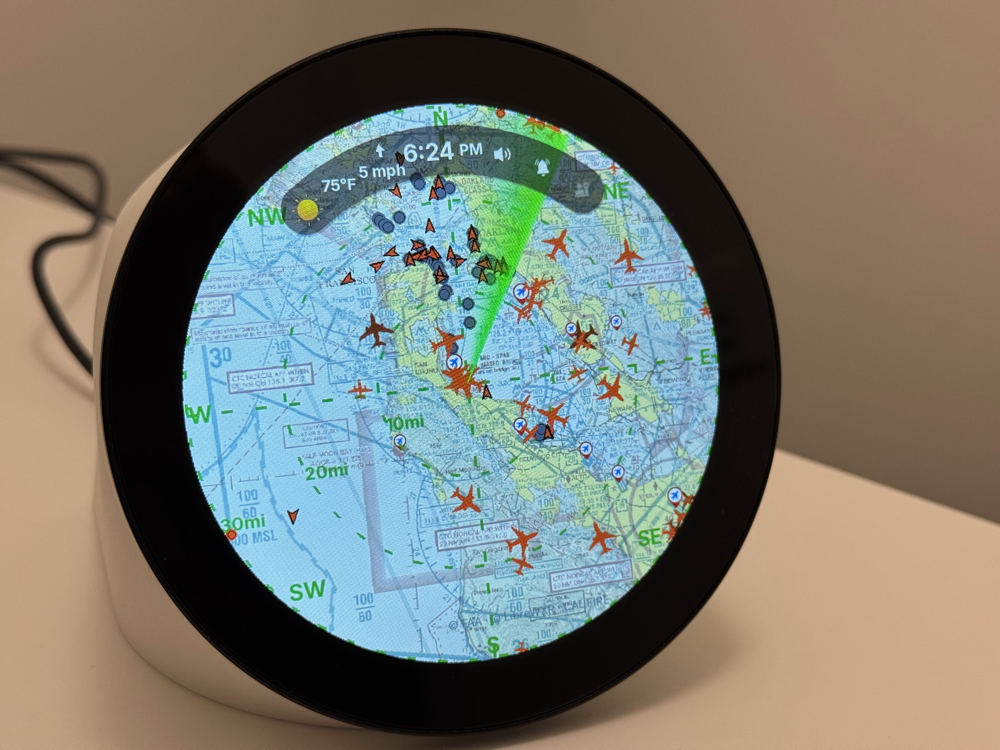

**VFR**

</td>
<td width="50%"></td>
</tr>
</table>

### Radar clock HUD

Optional frosted HUD on the radar: time, weather, wind, and US AQI. Light or dark pill, adjustable opacity, and per-channel audio controls (chime, tracked, military, **earthquake voice**, ATC).

<table>
<tr>
<td align="center" width="50%">

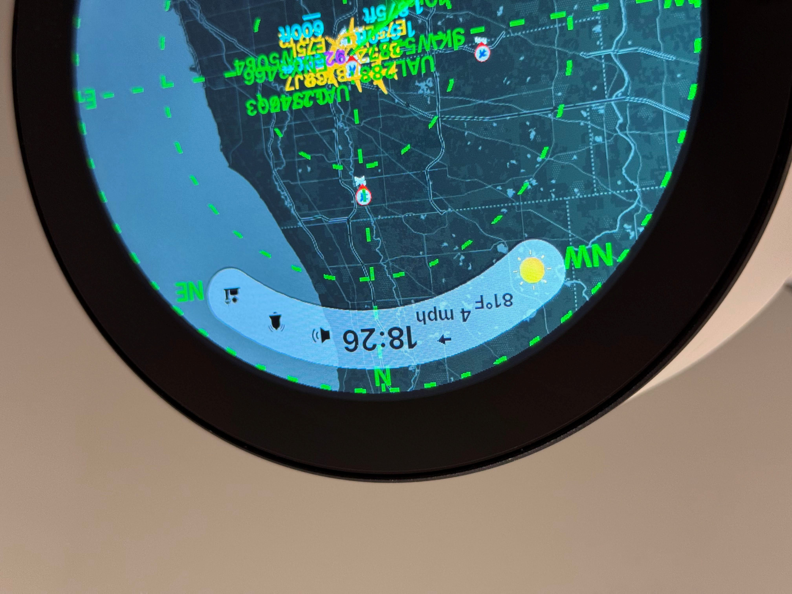

**HUD light**

</td>
<td align="center" width="50%">

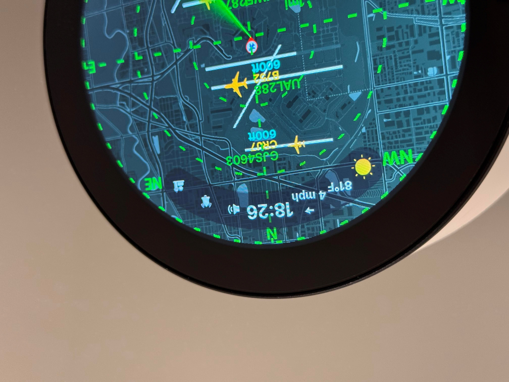

**HUD dark**

</td>
</tr>
<tr>
<td align="center" width="50%">

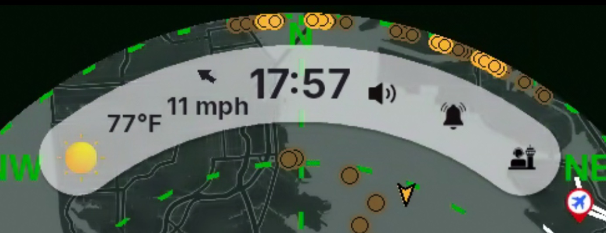

**HUD audio controls**

</td>
<td width="50%"></td>
</tr>
</table>

### Aircraft photos & marine AIS

Flight detail can show aircraft photos ([planespotters.net](https://www.planespotters.net/) / Wikimedia). Optional marine AIS from [aisstream.io](https://aisstream.io/) puts vessels on the same radar, with ship photos from Wikimedia Commons. **Note:** aisstream.io is known to be unreliable — if marine traffic disappears, check your portal settings and the [upstream status monitors](https://github.com/yashmulgaonkar/FlightScnr_Pi/wiki/Troubleshooting#13-marine-ais-traffic-not-visible-on-radar) before assuming a FlightScnr Pi bug.

<table>
<tr>
<td align="center" width="50%">

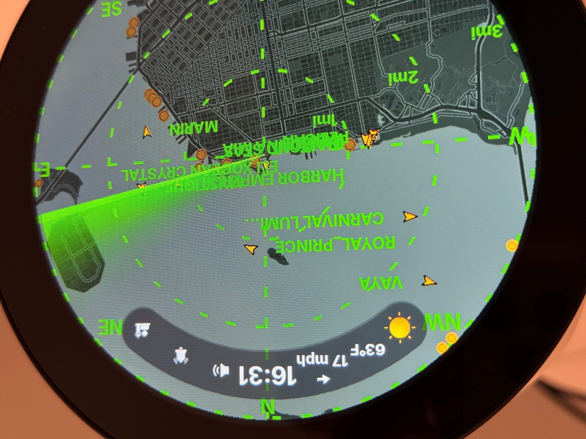

**Marine traffic**

</td>
<td align="center" width="50%">

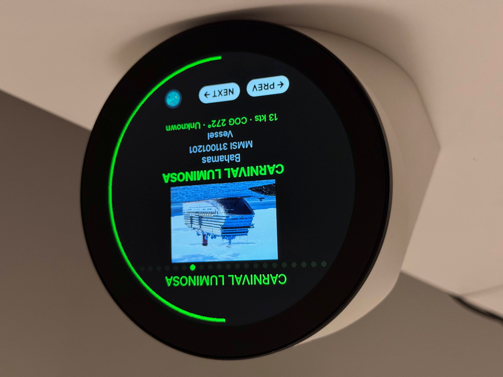

**Vessel detail**

</td>
</tr>
<tr>
<td align="center" width="50%">

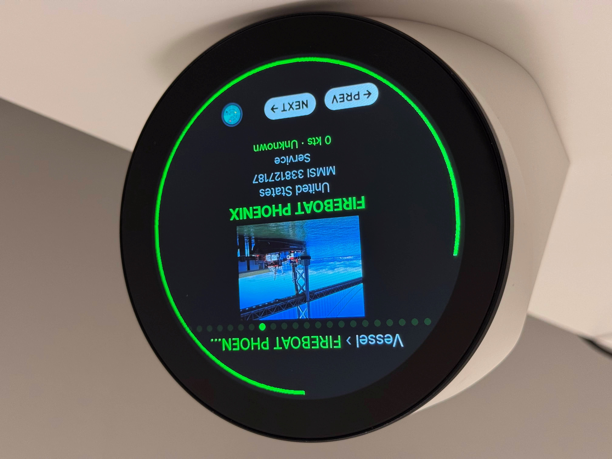

**Vessel detail**

</td>
<td width="50%"></td>
</tr>
</table>

### ATC audio

Optional **LiveATC** streams to a USB or Bluetooth speaker — pick airport and channel on-device or in the portal.

<table>
<tr>
<td align="center" width="50%">

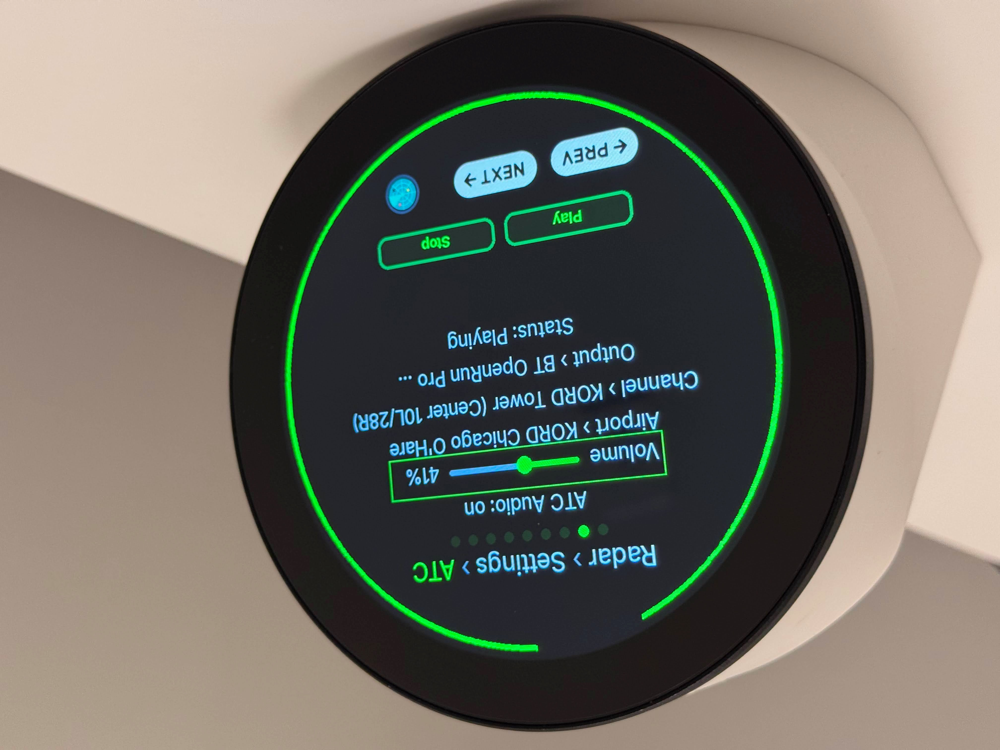

**ATC settings**

</td>
<td align="center" width="50%">

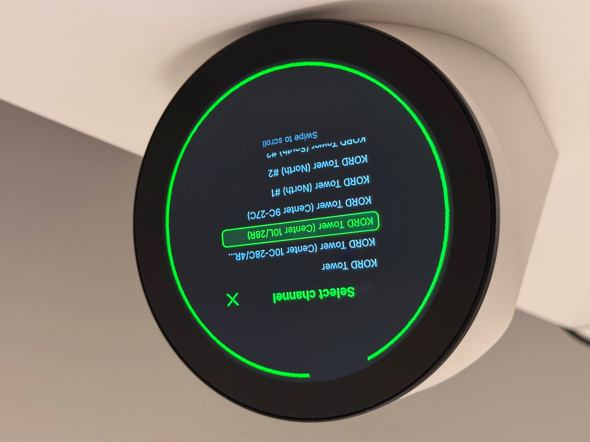

**Channel picker**

</td>
</tr>
</table>

Also included: scrollable **list pickers** for on-device settings, portal **Route Sources** / **Position Sources**, alert mode, facing / orientation, favorite locations (swipe-left cycle), a boot safety disclaimer, and portal OTA (**Update Now**, **Later tonight**, **Finish install**, **Repair & Update**). See the [Features wiki](https://github.com/yashmulgaonkar/FlightScnr_Pi/wiki/Features) for the full list.

---

## Documentation

**Full guides live in the [Wiki](https://github.com/yashmulgaonkar/FlightScnr_Pi/wiki).** Start there for build, install, features, and troubleshooting.

| Topic | Wiki page |
| ----- | --------- |
| Screens, gestures, radar, marine, ATC, wildfires, earthquakes | [Features](https://github.com/yashmulgaonkar/FlightScnr_Pi/wiki/Features) |
| Bill of materials | [Hardware](https://github.com/yashmulgaonkar/FlightScnr_Pi/wiki/Hardware) |
| Physical assembly | [Hardware Assembly](https://github.com/yashmulgaonkar/FlightScnr_Pi/wiki/Hardware-Assembly) |
| OS, display overlay, install, Wi‑Fi, config | [Software Setup](https://github.com/yashmulgaonkar/FlightScnr_Pi/wiki/Software-Setup) |
| Portal sections and settings | [Web Portal](https://github.com/yashmulgaonkar/FlightScnr_Pi/wiki/Web-Portal) |
| FR24, adsb.fi, weather, AIS, and more | [Data Sources](https://github.com/yashmulgaonkar/FlightScnr_Pi/wiki/Data-Sources) |
| Touch, pinch-zoom (X11), AIS outages, common fixes | [Troubleshooting](https://github.com/yashmulgaonkar/FlightScnr_Pi/wiki/Troubleshooting) |
| Updating from the portal (Later tonight, off-hours auto-install) | [Updates](https://github.com/yashmulgaonkar/FlightScnr_Pi/wiki/Updates) |
| Credits and license details | [Credits and License](https://github.com/yashmulgaonkar/FlightScnr_Pi/wiki/Credits-and-License) |

**Upgrading from older builds:** one **Update Now** is usually enough. Portal options also include **Later tonight**, **Auto-install during off-hours**, **Finish install**, and **Repair & Update**. If an OTA pulled a newer installer but could not run it (pre-re-exec path), the device **auto-finishes** install steps after restart — or use **Finish install** in the portal. If LightDM is switched to X11 for pinch-zoom, the Pi **reboots automatically**.

**Stuck on `2026.8.5.x` (Update fails silently):** an older install step flipped permissions on `scripts/release.sh`, which used to block the update pull. That file is now frozen upstream, so pressing **Update Now** once more in the portal should work — no terminal needed. If it still fails (other local edits, corrupted git store), run on the Pi:

```bash
curl -fsSL https://raw.githubusercontent.com/yashmulgaonkar/FlightScnr_Pi/main/scripts/repair-ota.sh | bash
```

Use `| bash -s -- --hard` only if other local edits also block the pull.

---

## Quick install

1. Gather parts and assemble the unit — see [Hardware](https://github.com/yashmulgaonkar/FlightScnr_Pi/wiki/Hardware) and [Hardware Assembly](https://github.com/yashmulgaonkar/FlightScnr_Pi/wiki/Hardware-Assembly).
2. Flash Raspberry Pi OS (64-bit, with desktop), enable the Waveshare panel overlay, then:

```bash
git clone https://github.com/yashmulgaonkar/FlightScnr_Pi.git ~/FlightScnr_Pi
cd ~/FlightScnr_Pi
sudo bash install-pi.sh
```

The installer forces the desktop to **X11** (needed for pinch-to-zoom) and **reboots automatically** when that switch is pending. It also enables the enclosure cooling fan via the kernel `gpio-fan` overlay (**GPIO 14**, on at **60°C**), disables Wi‑Fi power save for kiosk reliability, and enables Bluetooth for speaker pairing.

3. Open the web portal at `http://<hostname>.local` and add API keys.

Step-by-step instructions: [Software Setup](https://github.com/yashmulgaonkar/FlightScnr_Pi/wiki/Software-Setup).

---

## Contributing

Contributions are welcome. If you find a bug, have an idea, or want to improve the project, open a [pull request](https://github.com/yashmulgaonkar/FlightScnr_Pi/pulls). For larger changes, opening an [issue](https://github.com/yashmulgaonkar/FlightScnr_Pi/issues) first is helpful so we can discuss the approach.

Questions or setup help? Join the **FlightScnrPi Discord**:

<div align="center">
<a href="https://discord.gg/wjqgUjv8Re"></a>
</div>

---

## Credits

- Parts of this repo are based on code by [c0wsaysmoo](https://github.com/c0wsaysmoo), used with their prior written permission. Thank you!
- AIS WebSocket client design adapted from [capsule-radar-ais](https://github.com/socquique/capsule-radar-ais) (MIT).
- Aircraft photos courtesy of [planespotters.net](https://www.planespotters.net/) contributors (when credited on screen).
- Vessel photos from [Wikimedia Commons](https://commons.wikimedia.org/) contributors under their respective licenses.
- Precipitation radar tiles primarily from **[LibreWXR](https://librewxr.net/)** by Joshua Kimsey (public API [`api.librewxr.net`](https://api.librewxr.net/)), licensed under [CC BY 4.0](https://creativecommons.org/licenses/by/4.0/). Fallback: [RainViewer](https://www.rainviewer.com/). See [`flightscnr/display/round_touch/PRECIP_ATTRIBUTION.md`](flightscnr/display/round_touch/PRECIP_ATTRIBUTION.md).

Full asset attributions: [Credits and License](https://github.com/yashmulgaonkar/FlightScnr_Pi/wiki/Credits-and-License).

---

## License

### Firmware

Original application code, tools, and documentation in this repository are licensed under **[Creative Commons Attribution-NonCommercial-ShareAlike 4.0 International](https://creativecommons.org/licenses/by-nc-sa/4.0/)** ([LICENSE](LICENSE)). Required attribution text is in [NOTICE](NOTICE).

- **Attribution:** credit the author (Yash Mulgaonkar), link to https://github.com/yashmulgaonkar/FlightScnr_Pi and the license when you share or adapt this work.
- **NonCommercial:** you may not use this material for commercial purposes without separate permission.
- **ShareAlike:** adaptations must be released under the same license.

First-party source files include a copyright / SPDX / `[AI-DIRECTIVE]` header. Do not remove those headers. AI coding agents and forks should follow [AGENTS.md](AGENTS.md) (and `.cursor/rules/license-attribution.mdc`) so attribution and license terms stay intact.

### Enclosure license

The 3D-printed enclosure is **not** part of this firmware repository. Its digital files and physical prints are governed by the license shown on the MakerWorld model page. There are two print profiles on the same model:

- [Enclosure without speaker](https://makerworld.com/en/models/3024952-flightscnrpi-large-ads-b-traffic-sweeping-radar#profileId-3399104)
- [Enclosure with speaker](https://makerworld.com/en/models/3024952-flightscnrpi-large-ads-b-traffic-sweeping-radar#profileId-3532792)

That content is published under a **Standard Digital File License**, which includes terms such as:

> This user content is licensed under a Standard Digital File License.  
> You shall not share, sub-license, sell, rent, host, transfer, or distribute in any way the digital or 3D printed versions of this object, nor any other derivative work of this object in its digital or physical format (including - but not limited to - remixes of this object, and hosting on other digital platforms). The objects may not be used without permission in any way whatsoever in which you charge money, or collect fees.

Always read the full license on MakerWorld before downloading, printing, or sharing the enclosure design.

[](https://raw.githubusercontent.com/yashmulgaonkar/repo-analytics/main/out/FlightScnr_Pi/analytics.svg)

If you want to make your own analytics for your repos, [click here](https://github.com/yashmulgaonkar/repo-analytics).
